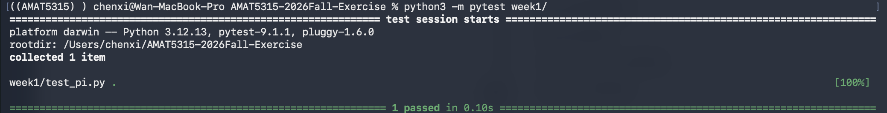

# AMAT5315 Fall 2026 Exercises

This repository contains my weekly exercises for AMAT5315. Week 1 includes a Monte Carlo program that estimates π and a test that checks its result.

## Install pytest

```bash
python3 -m pip install pytest
```

## Run the Week 1 test

From the repository's main folder, run:

```bash
python3 -m pytest week1/
```

## Test result



The Week 1 test completed successfully: **1 passed**.
